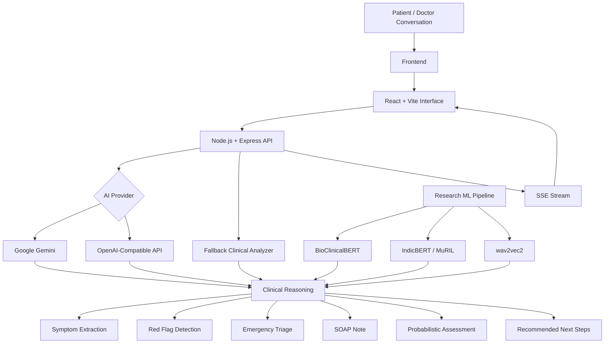

# <p align="center">🌷 Vineetra</p>

<p align="center">
  <strong>AI Clinical Copilot for a Multilingual India</strong>
</p>

<p align="center">
  <em>Ambient clinical intelligence, emergency triage, structured documentation & Bharat-first healthcare NLP.</em>
</p>

<p align="center">


</p>

---

<p align="center">

### ✦ Care should feel human. Intelligence should feel effortless. ✦

</p>

---

# 🤎 What is Vineetra?

**Vineetra** is a healthcare-focused AI platform designed around the idea of an **ambient clinical copilot** for healthcare workflows in India.

The system combines conversational input, clinical reasoning, triage-oriented analysis, structured documentation, multilingual understanding, and real-time analysis into a single interface.

Its central design philosophy is simple:

> **Reduce repetitive cognitive workload around the clinician — while keeping the clinician at the center of care.**

Vineetra is built around three major pillars:

```text
🎙️ Listen
     ↓
🧠 Understand
     ↓
🩺 Structure & Assist
````

The repository combines:

```text
React + Vite
        +
Node.js + Express
        +
Generative AI APIs
        +
Clinical NLP / ML Research
        +
Real-Time Streaming UI
```

---

# 🌸 The Vision

Healthcare conversations are naturally messy.

A single consultation may contain:

* multiple speakers
* regional languages
* code-mixed speech
* symptoms expressed informally
* incomplete clinical information
* urgency signals
* structured and unstructured observations

Vineetra explores how AI can turn that information into a more usable clinical workflow:

```text
Patient–Doctor Conversation
          ↓
   Language Understanding
          ↓
   Symptom Extraction
          ↓
   Red-Flag Detection
          ↓
   Emergency Triage
          ↓
   Structured SOAP Note
          ↓
   Probabilistic Assessment
          ↓
   Recommended Next Steps
```

---

# ✨ Core Capabilities

## 🎙️ 01 — Ambient Clinical Intelligence

Vineetra is conceptually designed for hands-free clinical interaction.

The project focuses on:

```text
Continuous conversational input
Speaker-aware interaction
Clinical context extraction
Noise-resilient processing
Real-time transcription workflows
```

The frontend/backend architecture also includes a streaming-analysis pathway using **Server-Sent Events (SSE)**.

---

# 🩺 02 — Clinical Reasoning & Triage

The primary clinical analysis endpoint accepts a transcript and language and generates structured clinical information.

The system is designed to produce:

```text
Emergency Triage
      ↓
Symptom Extraction
      ↓
Red Flags
      ↓
Structured SOAP Note
      ↓
Disease Prediction
      ↓
Recommended Next Steps
```

The triage representation uses:

```text
ESI Level: 1–5
Risk Level:
• Stable
• Moderate
• High
• Critical
```

This structure mirrors the application's intended workflow rather than replacing clinician judgment.

---

# 🚨 03 — Red-Flag Detection

Vineetra identifies potentially concerning symptoms from the provided conversation.

The implemented fallback analysis, for example, looks for symptom and urgency-related terms and can surface signals associated with:

```text
Chest pain
Breathlessness
Dizziness
Severe symptoms
Headache
Fever
Cough
Vomiting
Pain
Swelling
```

When potential red flags are detected, the fallback workflow can escalate the suggested response toward urgent medical attention and further evaluation.

---

# 📝 04 — Structured SOAP Documentation

One of Vineetra's key workflow goals is converting an unstructured clinical conversation into a structured clinical note.

The output format includes:

### Subjective

Patient-reported complaints and conversation-derived history.

### Objective

```text
Vitals
Clinical examination findings
```

### Assessment

Potential clinical interpretations or differentials.

### Plan

Suggested next actions based on the generated analysis.

Conceptually:

```text
Raw Conversation
       ↓
Clinical NLP
       ↓
┌─────────────────────────┐
│ S — Subjective          │
│ O — Objective           │
│ A — Assessment          │
│ P — Plan                │
└─────────────────────────┘
```

---

# 🇮🇳 05 — Bharat-First Language Intelligence

Vineetra is explicitly designed around the linguistic realities of Indian healthcare.

The project documentation emphasizes:

```text
21 Indian languages
Hinglish / code-mixed language
Regional language variation
Dialect-aware interaction
```

The ML stack referenced by the repository includes:

```text
IndicBERT
MuRIL
```

for multilingual and Indian-language-oriented NLP experimentation.

The goal is to move beyond an English-only clinical workflow and better accommodate how patients naturally communicate.

---

# 💬 Hinglish & Code-Mixed Understanding

A patient does not necessarily speak in perfectly separated languages.

Real conversations can look like:

```text
"Doctor mujhe kal se fever hai
aur thoda breathless feel ho raha hai."
```

Vineetra's language strategy is designed to preserve meaning across this kind of code-mixed interaction.

This makes the system particularly relevant to multilingual conversational healthcare interfaces.

---

# 🧠 06 — Clinical AI Model Stack

The repository describes a layered model architecture.

| Layer                    | Technology / Model                             |
| ------------------------ | ---------------------------------------------- |
| **Reasoning**            | Claude / Gemini / OpenAI-compatible generation |
| **Clinical Context**     | BioClinicalBERT                                |
| **Multilingual NLP**     | IndicBERT / MuRIL                              |
| **Audio Representation** | wav2vec2                                       |
| **Speech / Audio**       | AI-assisted transcription workflow             |

The current backend implementation supports both:

```text
Google Gemini
```

and an:

```text
OpenAI-compatible Chat Completions pathway
```

depending on the configured API key.

---

# 🤖 07 — Generative AI Clinical Analysis

The backend can route clinical prompts through a generative AI provider and request a strict structured JSON response.

The expected output contains:

```json
{
  "Emergency Triage": {},
  "Symptom Extraction": [],
  "Red Flags": [],
  "Structured SOAP Note": {},
  "Disease Prediction (Probabilistic)": [],
  "Recommended Next Steps (ER/OPD/Home)": []
}
```

This structured interface makes the generated response easier for the frontend to interpret and display.

---

# 🪄 08 — Graceful AI Fallback

Vineetra includes a local fallback analysis pathway.

If the external AI provider fails, the backend can switch to deterministic rule-based logic that:

```text
Extracts recognized symptoms
↓
Checks for red flags
↓
Assigns a basic triage category
↓
Creates a fallback SOAP-style structure
↓
Provides general next-step suggestions
```

This allows the application workflow to remain testable even when an external AI service is unavailable.

The fallback is an application-resilience feature, not a substitute for clinical validation.

---

# ⚡ 09 — Real-Time Streaming

The backend exposes an SSE-based stream-analysis route for real-time interface updates.

The stream can emit events such as:

```text
TRANSCRIPT_UPDATE
```

along with:

```text
content
stressScore
emotion
```

This creates the foundation for a live ambient-assistant experience where the interface can progressively react to incoming conversational signals.

---

# 🎨 10 — Human-Centered Interface

The Vineetra frontend is built around a calm, premium interaction philosophy.

The technology stack includes:

```text
React 19
Vite
TypeScript
TailwindCSS
Framer Motion
Lucide React
Axios
jsPDF
```

The intended experience combines:

```text
Soft visual hierarchy
Minimal friction
Clinical dashboards
Animated interaction
Structured information cards
Accessible workflow visualization
```

The interface is deliberately positioned as a **clinical copilot experience**, rather than a conventional chatbot.

---

# 🖥️ Full System Architecture



---

# 🔄 End-to-End Clinical Workflow

```text
┌──────────────────────────────┐
│     Patient Consultation     │
└──────────────┬───────────────┘
               ↓
       🎙️ Conversation
               ↓
     🌐 Language Context
               ↓
     🧠 Clinical Analysis
               ↓
 ┌─────────────┼─────────────┐
 ↓             ↓             ↓
Symptoms    Red Flags      Triage
 ↓             ↓             ↓
 └─────────────┼─────────────┘
               ↓
        📝 Structured SOAP
               ↓
      📊 Assessment Output
               ↓
      🩺 Next-Step Support
```

---

# 🧪 Clinical ML Research Pipeline

The repository also contains a dedicated training script for a clinical triage classifier.

The research-oriented implementation uses:

```text
PyTorch
Transformers
BioClinicalBERT
MuRIL / IndicNLP concepts
Scikit-learn
Pandas
NumPy
```

The triage classifier maps clinical language into five ESI-related classes:

```text
ESI 1
ESI 2
ESI 3
ESI 4
ESI 5
```

Conceptually:

```text
Clinical Text
      ↓
Tokenizer
      ↓
BioClinicalBERT
      ↓
768-D representation
      ↓
Dropout
      ↓
Linear Classifier
      ↓
5 ESI Classes
```

---

# 📊 Model Evaluation

The repository's training script prints the following evaluation figures as part of its current research/demo pipeline:

```text
ESI Accuracy : 0.942
F1 Score     : 0.915
Latency      : 42 ms
```

These values are outputs documented by the training script and should be treated as **prototype/research figures**, not independently validated production benchmarks.

---

# 🌷 Why Vineetra is Different

Vineetra is not designed around one isolated AI feature.

Its architecture connects:

```text
🎙️ Conversation
      +
🇮🇳 Indian Language Understanding
      +
🧠 Clinical Reasoning
      +
🚨 Triage
      +
📝 Documentation
      +
⚡ Real-Time Interaction
```

into a unified healthcare workflow.

---

# 🏥 Designed Around the Indian Context

The platform's India-first positioning comes from three architectural choices:

### 🇮🇳 Language

Designed around Indian languages and code-mixed communication.

### 🩺 Workflow

Focused on triage and clinical documentation rather than generic conversation.

### 💻 Accessibility

Built using web technologies that can support lightweight browser-based interfaces and independently deployed backend services.

---

# 🗂️ Repository Structure

```text
Vineetra-Bharat/
│
├── backend/
│   ├── src/
│   │   └── server.js
│   ├── package.json
│   └── .env.example
│
├── frontend/
│   ├── src/
│   ├── public/
│   ├── package.json
│   ├── vite.config.ts
│   ├── tailwind.config.js
│   └── vercel.json
│
├── scripts/
│   └── train_clinical_model.py
│
├── deployment/
│   └── DEPLOYMENT_GUIDE.md
│
├── uploads/
│
├── .env.example
├── render.yaml
├── README.md
└── requirements-render.txt
```

---

# 🛠️ Technology Stack

| Layer                       | Technologies                          |
| --------------------------- | ------------------------------------- |
| **Frontend**                | React 19, Vite                        |
| **Language**                | TypeScript                            |
| **Styling**                 | TailwindCSS                           |
| **Animation**               | Framer Motion                         |
| **Icons**                   | Lucide React                          |
| **HTTP Client**             | Axios                                 |
| **PDF Generation**          | jsPDF                                 |
| **Backend**                 | Node.js, Express                      |
| **Security**                | Helmet, CORS, Express Rate Limit      |
| **Logging**                 | Morgan                                |
| **Identifiers**             | UUID                                  |
| **Generative AI**           | Google Gemini / OpenAI-compatible API |
| **Clinical NLP Research**   | BioClinicalBERT                       |
| **Multilingual NLP**        | IndicBERT / MuRIL                     |
| **Speech / Audio Research** | wav2vec2                              |
| **ML Framework**            | PyTorch                               |
| **Data Science**            | Pandas, NumPy, Scikit-learn           |
| **Deployment**              | Vercel + Render configuration         |

---

# 🚀 Getting Started

## 1. Clone the Repository

```bash
git clone https://github.com/ViivianREINE/Vineetra-Bharat.git

cd Vineetra-Bharat
```

---

# 🖥️ Start the Backend

```bash
cd backend

npm install

npm start
```

For development:

```bash
npm run dev
```

The backend uses:

```text
PORT
```

from the environment and falls back to port `10000`.

---

# 🎨 Start the Frontend

Open another terminal:

```bash
cd frontend

npm install

npm run dev
```

Vite will start the development interface.

---

# 🔐 Environment Variables

Create:

```text
backend/.env
```

based on:

```text
backend/.env.example
```

Typical configuration:

```env
GEMINI_API_KEY=your-gemini-api-key
OPENAI_API_KEY=
PORT=10000
NODE_ENV=development
```

Never commit real API credentials.

---

# 🌐 API Endpoints

## `GET /health`

Returns service health and active AI provider information.

Example structure:

```json
{
  "status": "active",
  "version": "2.0.1-elite",
  "engine": "gemini-1.5-flash",
  "provider": "google-gemini",
  "apiKeyConfigured": true
}
```

---

## `POST /api/analyze-clinical`

Main clinical reasoning endpoint.

### Request

```json
{
  "transcript": "Patient has fever and cough since yesterday.",
  "language": "en-IN"
}
```

### Returns

```text
Emergency Triage
Symptom Extraction
Red Flags
Structured SOAP Note
Disease Prediction
Recommended Next Steps
Analysis ID
```

---

## `GET /api/stream-analysis`

Provides a Server-Sent Events stream for real-time analysis updates.

Example event structure:

```json
{
  "type": "TRANSCRIPT_UPDATE",
  "content": "Processing ambient snippet...",
  "stressScore": 32,
  "emotion": "Calm"
}
```

---

# ☁️ Deployment

The repository includes deployment configuration for a split frontend/backend setup.

```text
                 ┌───────────────┐
                 │     Vercel    │
                 │    Frontend   │
                 └───────┬───────┘
                         │
                         ↓
                 ┌───────────────┐
                 │    Render     │
                 │    Backend    │
                 └───────────────┘
```

### Backend

Deployment configuration is provided for **Render**.

Typical commands:

```bash
npm install
npm start
```

Health check:

```text
/health
```

### Frontend

The frontend is configured for **Vercel** using Vite.

Build:

```bash
npm run build
```

---

# 🛡️ Security Considerations

The backend includes several web-service security mechanisms:

```text
Helmet
CORS
Express Rate Limit
Environment-based Secrets
Request Validation
```

However, deployment in a real clinical setting would require a substantially broader security, privacy, compliance, audit, and data-governance review.

---

# ⚠️ Clinical Safety & Scope

Vineetra is an **AI-assisted clinical workflow prototype**.

Generated:

```text
triage levels
symptom interpretations
disease predictions
recommended actions
```

should not be treated as autonomous medical decisions.

Clinical use would require appropriate:

```text
Clinical validation
Safety evaluation
Human oversight
Privacy controls
Regulatory assessment
Bias evaluation
Dataset validation
Monitoring
Auditability
```

The current project demonstrates the software and AI workflow rather than establishing clinical efficacy.

---

# 🌱 Future Scope

The architecture provides a foundation for further development in:

```text
• More robust Indian-language speech recognition
• Speaker diarization
• Dedicated clinical speech models
• Clinical entity recognition
• Better symptom normalization
• More rigorous ESI classification
• Longitudinal patient context
• Clinical decision-support interfaces
• Hospital system integration
• FHIR interoperability
• Secure audit trails
• On-device / edge inference
• Human-in-the-loop review
• Clinical model monitoring
• Privacy-preserving healthcare AI
```

---

# 🌷 Design Philosophy

> ## Technology should make healthcare feel more human — not less.

Vineetra is built around a simple idea:

```text
Let clinicians focus on care.
Let AI help with the cognitive overhead.
```

The platform is intended to listen, structure, surface relevant signals, and organize information — while the healthcare professional remains responsible for interpretation and action.

---

# 🏆 Project Identity

### **Project**

**Vineetra — India's AI Clinical Copilot**

### **Core Theme**

```text
Ambient Clinical Intelligence
+
Multilingual Healthcare AI
+
Emergency Triage
+
Clinical Documentation
```

### **Built By**

**Priyam Parashar**

---

<p align="center">

## 🌷 Vineetra

<strong> ***Listen deeply. Understand context. Support care.*** </strong>

<br><br>

<em>Built with intelligence, empathy & a little bit of warmth. ♡</em>

</p>

